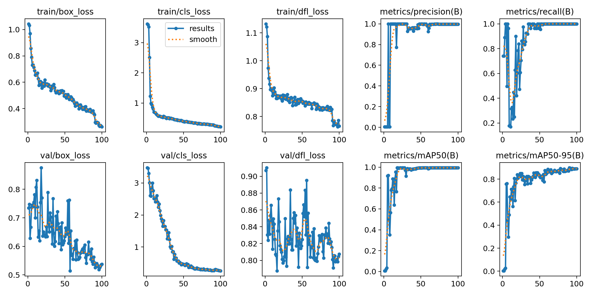
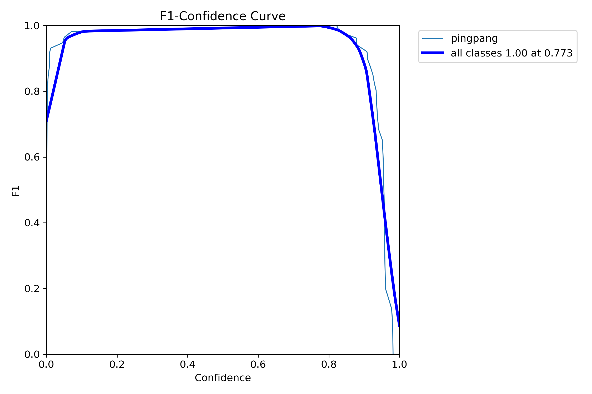

## Pingpang Detection Model

 notice : The detection model is only usable in an environment with opencv-python >= 4.7 with corresponding version of numpy. 

In this project the environment is:
* Raspberry Pi OS(32-bit or 64-bit)
* python3.11
* opencv-python = 4.7.0.72 with required dependencies installed using `pip install opencv-python==4.7.0.72 --break-system-packages`
* numpy = 1.26.4
* picamera2

The model is used to detect the position of a table tennis ball appears in the camera module of a raspberry pi (the used one is rasp pi 3A+ with 32bit armv7 CPU).

### Intro

We would like to implement a tracking algorithm for the cart for a certain object. In actual testing, we found that the variability of the background and the possible obstruction of hand-held objects made the direct use of feature templates of a certain object for applying recognition more difficult to achieve, with a low accuracy rate. At the same time, due to the performance limitations of the Raspberry Pi 3A+, we do not have the ability to directly call a more accurate but larger model (and after testing, even the yolov8x model still does not meet the requirements for recognition accuracy for many objects, while the performance requirements are still very high). Therefore, we decided to train our own set of object recognition models for targeted object detection. Given the difficulty of recognition and the materials at hand, we decided to use a ping pong ball as the object.

### Data collection and Pre-processing

Images are captured by a cell phone, processed to the appropriate format by [process_images.py](process_images.py), and tagged using the [roboflow.com](https://roboflow.com/).

### Data Training

The training set validation set and test set were automatically divided by [roboflow.com](https://roboflow.com/) and certain augmentations were added. The yolov8n model was used as the basis for further training and fine-tuning, and finally best.pt was obtained as the trained model, seen in [train_model_gpu.py](train_model_gpu.py) . Then the model is exported as .onnx model by [export_onnx.py](export_onnx.py)  for rasp pi to run through opencv.dnn (32-bit arm-v7 rasp pi is almost impossible to install onnxruntime). The trained model [best.pt](models/best.pt) is exported as [best.onnx](models/best.onnx) (for newer versions of opencv)and [best1.onnx](models/best1.onnx) (simplified to run on a rasp pi 3A+).

#### Training Results

 The training results on validation set are as follows:

| Images | Instances | Precision(P) | Recall(R) | mAP@0.5 | mAP@0.5:0.95 |
| :----: | :-------: | :----------: | :-------: | :-----: | :----------: |
|   28   |    27     |    0.998     |   1.000   |  0.995  |    0.898     |

It can be seen that during the training process, the box loss, class loss and dfl loss of both the training and validation sets show a relatively stable decreasing trend, which represents that the training process is effective and there is no obvious overfitting(After testing, we found that inaccuracies due to overfitting have started to appear more obviously when epoch=150 is selected, e.g. faces are recognized as having a higher probability of being ping pong balls). The trained model, achieved a precision of 0.998 and a recall of 1.000, which represents a very accurate result of the training, along with almost no false detections. In addition, we also see that the value of mAP is also quite high, representing an accurate recognition result.

According to the obtained F1 chart, which takes into account the values of precision and recall together and gives the results, we find that the value of F1 is very high at the majority of the confidence levels, ensuring the accuracy of the model. In view of the fact that it achieved the highest value at a confidence of 0.773, we finally decided to select 0.75 as the confidence threshold in the real scenario.

### Model Testing

* [test_model.py](test_model.py) Tested the effects of the best.pt model.
* [test.py](test.py) is used to verify the effectiveness of models exported to onnx format, and also to test the compatibility of opencv-python, python, onnx, etc. on windows.
*  [pingpangDetection.py](pingpangDetection.py) is the version that actually runs on the Raspberry Pi, and is used to check model and program and camera call compatibility on the Raspberry Pi, as well as exploring performance overheads.

We found that for the Raspberry Pi 3A+, the model still has quite a large recognition performance overhead, only managing to do roughly 0.2 fps. when tested on the Raspberry Pi 5, it was quite smooth and almost stress-free, easily managing to do around 10 fps.
